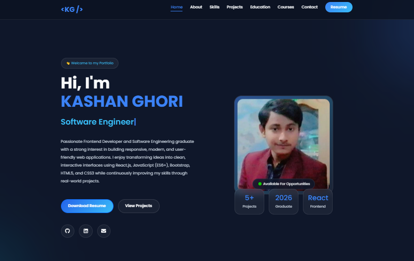
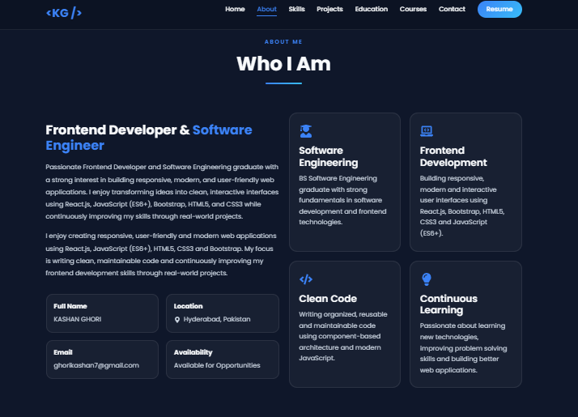
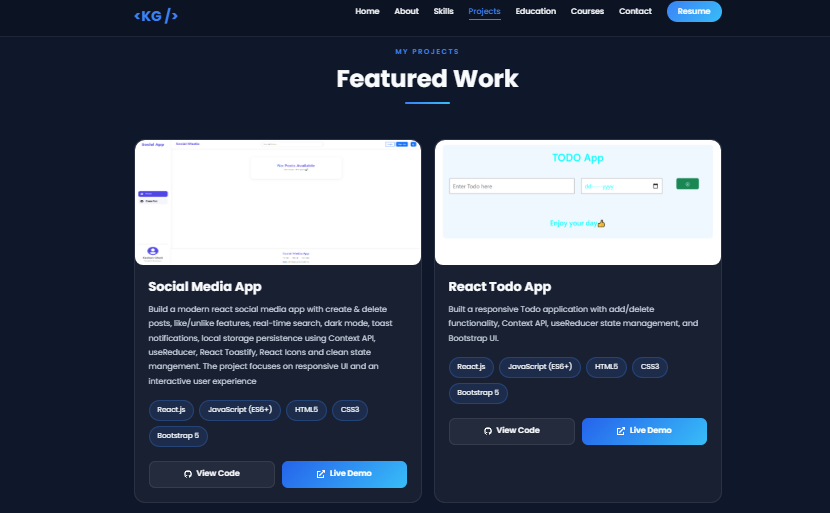
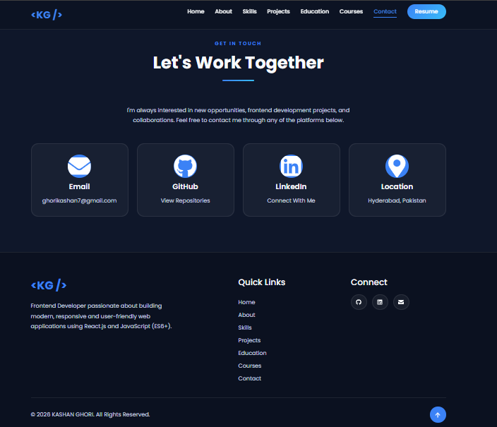

# 💼 Personal Portfolio Website


---

## 📖 About

A modern, responsive, and interactive personal portfolio website built using **React.js**, **Bootstrap 5**, **JavaScript (ES6+)**, **HTML5**, and **CSS3**.

The portfolio showcases my technical skills, projects, education, courses, and contact information with a clean UI, smooth user experience, and fully responsive layout across desktop, tablet, and mobile devices.

---

## Preview



---

## [🔗View Live Portfolio](https://portfolio-tau-umber-17.vercel.app)

---

## 📸 Screenshots

## About Section



---

## Projects Section



---

## Contact Section



---

## ✨ Features

- 🎨 Modern UI Design
- 📱 Fully Responsive Layout
- ⚛ Built with React.js
- 🚀 Powered by Vite
- 🧩 Reusable Components
- 📝 Downloadable Resume
- 🔤 Typing Animation
- 📂 Projects Showcase
- 🎓 Education & Courses Timeline
- 📧 Contact Section
- 🌐 Social Media Links
- 💡 Clean Code Structure

---

## 🛠 Technologies Used

- React.js
- JavaScript (ES6+)
- HTML5
- CSS3
- Bootstrap 5
- Vite
- React Icons
- Typed.js

---

## 📂 Folder Structure

```
src
│
├── assets
│   ├──images
│   └──resume
│
│
├── components
│   ├── About
│   ├── Contact
│   ├── Courses
│   ├── Education
│   ├── Footer
│   ├── Hero
│   ├── Navbar
│   ├── Projects
│   ├── Skills
│   └── Common
│
├──data
├──App.jsx
├──index.jsx
└──main.jsx
```

---

## Connect with Me

Feel free to connect with me on Linkedin and check out my projects!

If you like this project, don't forget to star ⭐ the repository!

[🔗Linkedin](https://www.linkedin.com/in/kashan-ghori-9b50b43b4)

[🔗GitHub](https://github.com/KG-SE)

---

## 👨‍💻 Author

**Kashan Ghori**
